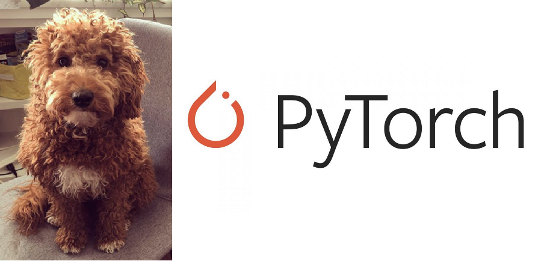
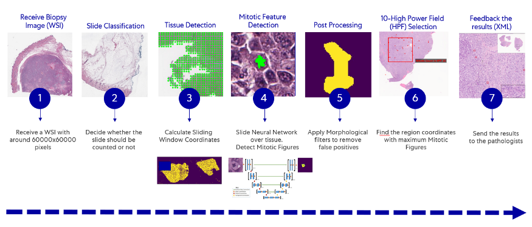

     
    
    </a>
     

<h2 align="center">

Onco Pet 🐾

</h2>

## 🆕 Actualización
- 21/09/21: Proyecto creado

 TODO:
- ⬜️ Búsqueda de literatura

## ℹ️ Introducción
***Onco Pet*** es un sistema automático de detección y segmentación de zonas cancerígenas especializada en mascotas (especialmente perros).

[Artículo principal](https://medium.com/pytorch/how-ai-is-helping-vets-to-help-our-pets-e6e3d58c052e)

     
    
    </a>
     

